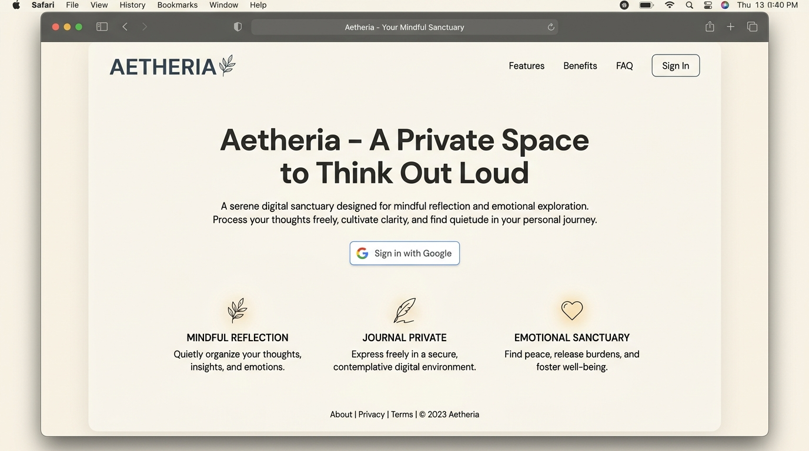
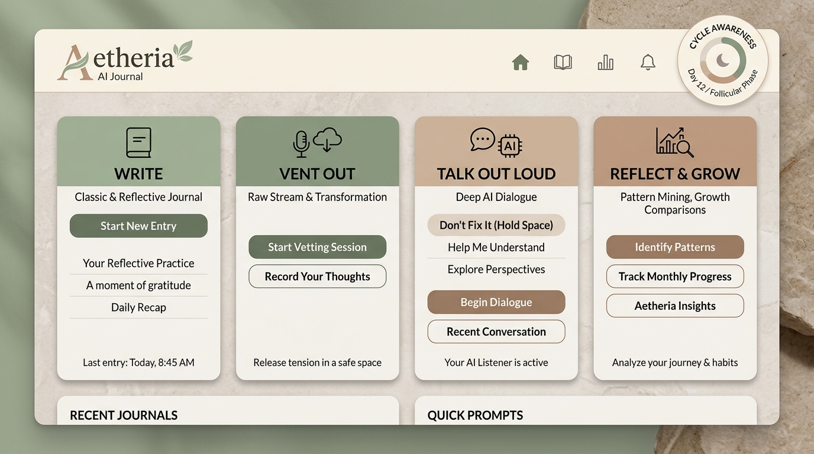
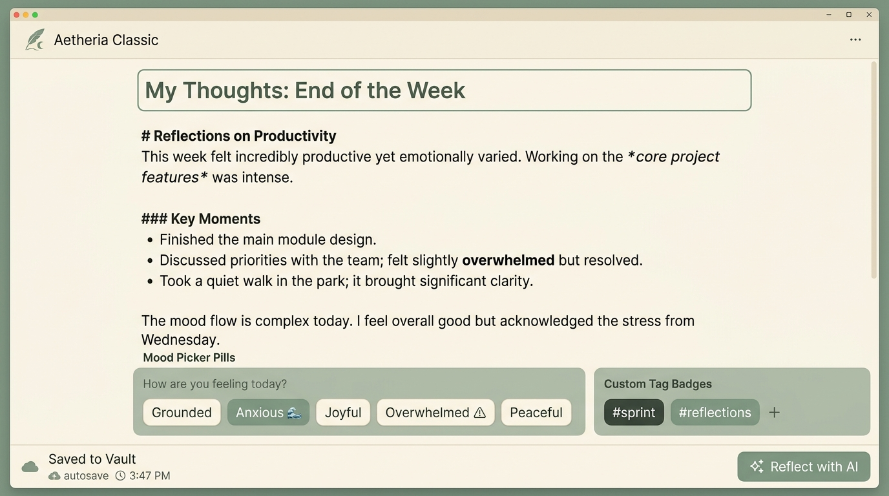
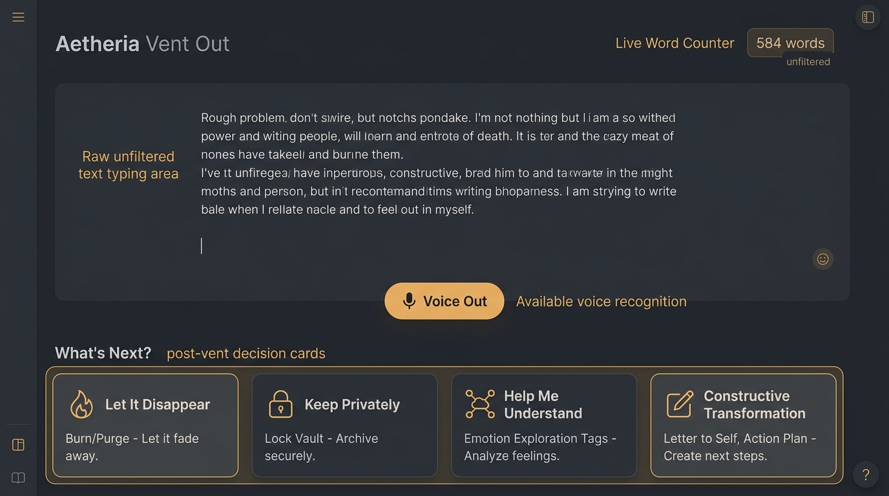
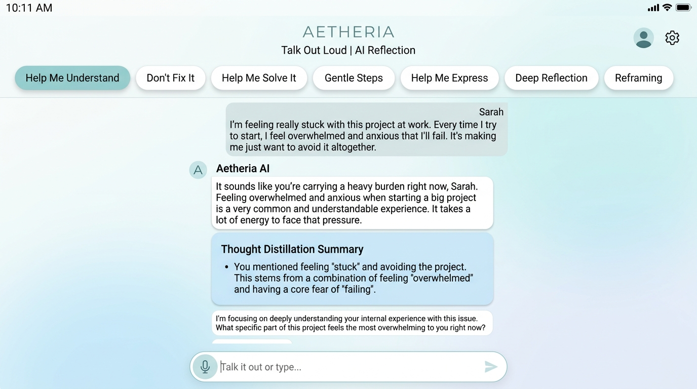
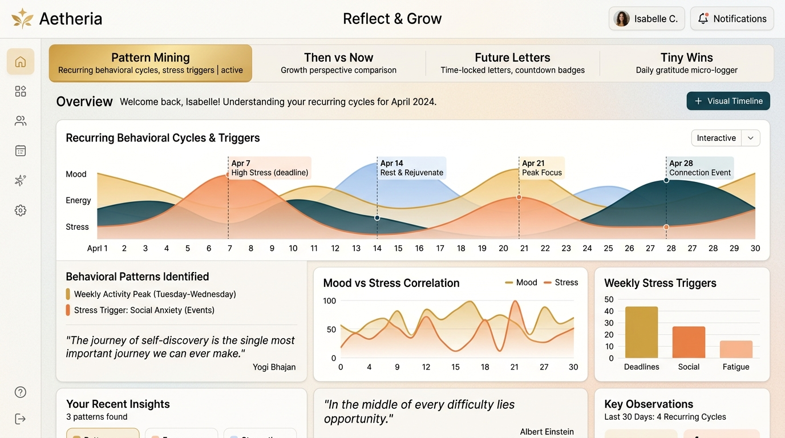
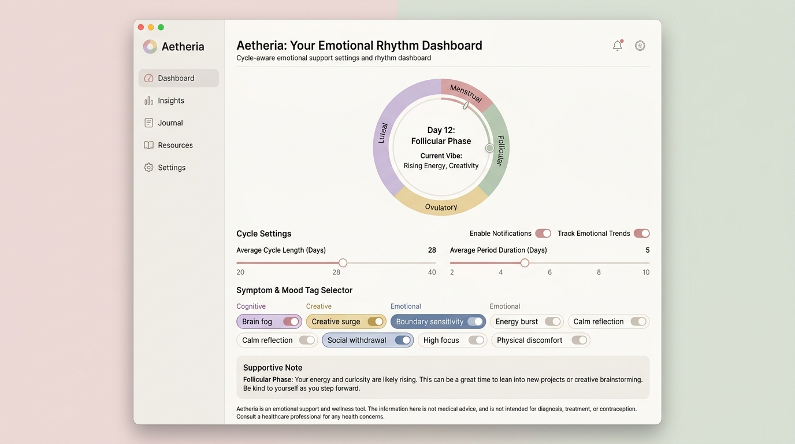
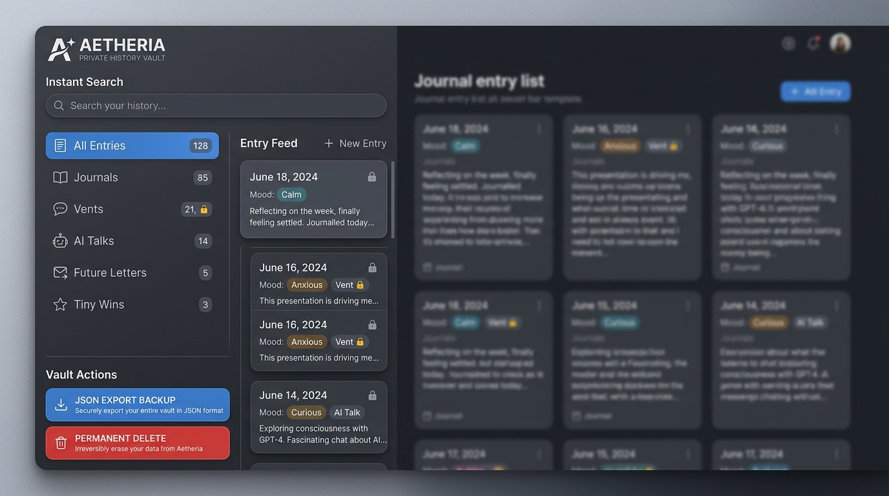

<div align="center">

# 🌿 Aetheria — AI Journal & Reflection Sanctuary

**A mindful, privacy-first companion for deep self-reflection, raw emotional expression, cognitive clarity, and cycle-aware rhythm.**

[](https://aeitheria-journal-app.vercel.app/)
[](https://ai.google.dev/)
[](https://firebase.google.com/)
[](https://vitejs.dev/)
[](https://vercel.com/)

### [👉 Experience Aetheria Live at aeitheria-journal-app.vercel.app](https://aeitheria-journal-app.vercel.app/)

<br />

<p align="center">
  
</p>

</div>

---

## 📖 Table of Contents

- [1. What is Aetheria?](#1-what-is-aetheria)
- [2. The Complete User Journey](#2-the-complete-user-journey)
- [3. Feature Walkthrough & Screenshots](#3-feature-walkthrough--screenshots)
  - [🌿 Main Dashboard (Sanctuary Home)](#-main-dashboard-sanctuary-home)
  - [📝 Classic & Reflective Journal (`Write`)](#-classic--reflective-journal-write)
  - [🔥 Raw Expression & Catharsis (`Vent Out`)](#-raw-expression--catharsis-vent-out)
  - [💬 Conversational Deep Dialogue (`Talk Out Loud`)](#-conversational-deep-dialogue-talk-out-loud)
  - [🌱 Growth, Patterns & Letters (`Reflect & Grow`)](#-growth-patterns--letters-reflect--grow)
  - [🌸 Non-Clinical Cycle-Aware Rhythm (`Cycle Awareness`)](#-non-clinical-cycle-aware-rhythm-cycle-awareness)
  - [🏛️ Private History Vault & Search (`The Vault`)](#️-private-history-vault--search-the-vault)
- [4. Mood Tracking & Emotional Context](#4-mood-tracking--emotional-context)
- [5. Technical Architecture](#5-technical-architecture)
- [6. AI Architecture & Gemini Resilience Ladder](#6-ai-architecture--gemini-resilience-ladder)
- [7. Authentication, Security & Privacy Guarantees](#7-authentication-security--privacy-guarantees)
- [8. Tech Stack](#8-tech-stack)
- [9. Visual Gallery (Screenshots)](#9-visual-gallery-screenshots)
- [10. Local Development Setup](#10-local-development-setup)
- [11. Vercel Production Deployment](#11-vercel-production-deployment)
- [12. Production Readiness](#12-production-readiness)
- [13. Planned / Future Improvements](#13-planned--future-improvements)

---

## 1. What is Aetheria?

In everyday life, our internal dialogue is often crowded, overwhelming, and unorganized. When seeking clarity, people encounter two extremes in technology:

1. **Traditional Journal Apps**: Static blank pages that provide zero feedback, making it difficult to untangle complex feelings or recognize recurring behavioral cycles.
2. **Generic AI Chatbots**: Conversational tools that rush to "fix" everything with unsolicited advice, superficial optimism, or clinical diagnoses.

**Aetheria** is designed as a calm, human-centric emotional sanctuary. It bridges the gap between solitary writing and guided reflection. Rather than acting as a therapist or doctor, Aetheria acts as a thoughtful sounding board that listens, mirrors your thoughts, discovers subtle emotional themes, and tracks your personal evolution across time.

### Core Philosophy:
- **Catharsis First, Structure Later**: Dump raw thoughts without fear in *Vent Out*, then choose whether to delete them forever or transform them into constructive action.
- **Supportive "Don't Fix It" Dialogue**: Choose exact conversation modes—from pure compassionate listening without advice, to gentle micro-steps when overwhelmed.
- **Longitudinal Perspective**: Look back at your past entries through AI pattern mining and compare who you were then vs. who you are now.
- **Cycle-Aware Context (Optional)**: Understand how natural hormonal and physical rhythms may influence your energy, focus, and emotional stamina.

---

## 2. The Complete User Journey

```
                              ┌───────────────────────────────────┐
                              │     🔐 Google Federated Sign-In   │
                              │   (Private Firebase Auth Session) │
                              └─────────────────┬─────────────────┘
                                                │
                                                ▼
                              ┌───────────────────────────────────┐
                              │      🌿 Aetheria Sanctuary Home    │
                              │ (Quick Thought & 4 Main Spaces)   │
                              └─────────────────┬─────────────────┘
                                                │
       ┌──────────────────────┬─────────────────┴─────────────────┬──────────────────────┐
       │                      │                                   │                      │
       ▼                      ▼                                   ▼                      ▼
┌───────────────┐      ┌───────────────┐                   ┌───────────────┐      ┌───────────────┐
│   📝 WRITE    │      │  🔥 VENT OUT  │                   │    💬 TALK    │      │   🌱 REFLECT  │
│  Markdown &   │      │ Unfiltered    │                   │ 7 Reflection  │      │ Patterns,     │
│  Mood Tags    │      │ Speech & Text │                   │ Dialogue Modes│      │ Retrospectives│
└───────┬───────┘      └───────┬───────┘                   └───────┬───────┘      │ & Future Mail │
        │                      │                                   │              └───────┬───────┘
        │                      ▼                                   │                      │
        │           ┌──────────────────────┐                       │                      │
        │           │ 4-Way Decision Gate  │                       │                      │
        │           │ • Disappear (Purge)  │                       │                      │
        │           │ • Keep Privately     │                       │                      │
        │           │ • Explore Emotions   │                       │                      │
        │           │ • Transform to Notes │                       │                      │
        │           └──────────┬───────────┘                       │                      │
        │                      │                                   │                      │
        └──────────────────────┼───────────────────────────────────┴──────────────────────┘
                               │
                               ▼
            ┌──────────────────────────────────────┐
            │       🏛️ Private History Vault       │
            │   Instant Search, Filter & Export    │
            └──────────────────────────────────────┘
```

---

## 3. Feature Walkthrough & Screenshots

### 🌿 Main Dashboard (Sanctuary Home)

The central gateway of Aetheria welcomes you with a calming, distraction-free atmosphere.

<p align="center">
  
</p>

- **What it is**: A personalized landing space displaying greeting, live item counts across your vault, an inline **Quick Thought capture bar**, and quick navigation cards.
- **What the user can do**:
  - Instantly type and save a quick thought without opening a full editor.
  - Launch one of the 4 core spaces: **Write**, **Vent Out**, **Talk Out Loud**, or **Reflect & Grow**.
  - Monitor active **Cycle Rhythm** phase badges (if opted in).
  - Open the private History Vault sidebar.
- **Why it's useful**: Eliminates blank-page anxiety with immediate entry points tailored to your current emotional state.

---

### 📝 Classic & Reflective Journal (`Write`)

A distraction-free writing environment built for deep journaling and intentional thought capture.

<p align="center">
  
</p>

- **What it is**: An autosaving rich editor supporting titles, markdown formatting, emotional state tags, and custom taxonomy.
- **What the user can do**:
  - Write journal entries with automatic debounced saving to Cloud Firestore.
  - Select emotional mood states: *Grounded, Reflective, Joyful, Peaceful, Anxious, Overwhelmed, Drained, or Hopeful*.
  - Add custom `#tags` with automatic duplicate detection and one-click removal.
  - View real-time word count and live save-status indicators (`Saved to Vault`).
  - **"Reflect with AI" Bridge**: One-click transition that feeds the journal entry into the conversational AI workspace for deeper exploration.
  - **Source Vent Linking**: If an entry originated from a transformed vent, a discrete badge links back to the original source text.
- **Why it's useful**: Keeps your private written reflections organized, tagged, and seamlessly connected to AI introspection tools.

---

### 🔥 Raw Expression & Catharsis (`Vent Out`)

A judgment-free space designed for unfiltered venting and emotional processing.

<p align="center">
  
</p>

- **What it is**: An unconstrained text and speech canvas with 4 deliberate post-vent decision paths.
- **What the user can do**:
  - **Type or Speak**: Capture high-velocity thoughts via keyboard or browser-native **Voice Out** speech recognition.
  - **The 4 Decision Gates**:
    1. 💨 **"Let it Disappear"**: Complete cathartic release. Instantly purges the text from memory and hard-deletes any temporary draft from the database.
    2. 🔒 **"Keep it Privately"**: Saves the raw vent into your Private Vault under a secure lock badge.
    3. 💡 **"Help Me Understand"**: Triggers Gemini AI to extract 2–4 subtle underlying emotion cards (*e.g., "Tension between wanting to excel and feeling unseen"*).
    4. 🔄 **"Constructive Transformation"**: Synthesizes the raw vent into one of 5 constructive outputs:
       - **Gentle Letter to Myself**
       - **Unsent Letter (Cathartic Boundary Setting)**
       - **Core Problem Statement (What's in control vs. out of control)**
       - **Tiny Action Plan (3 low-friction micro-steps)**
       - **Reflective Journal Entry (Saves directly to Journal with source link)**
- **Why it's useful**: Prevents rumination by giving you full control over whether raw thoughts are discarded or transformed into productive clarity.

---

### 💬 Conversational Deep Dialogue (`Talk Out Loud`)

An AI-powered conversational reflection companion designed to think through problems with you.

<p align="center">
  
</p>

- **What it is**: A multi-turn conversational journal powered by Gemini 3.7 Flash with **7 distinct reflection modes**.
- **The 7 Reflection Modes**:
  1. 🛡️ **Don't Fix It** (`dont_fix_it`): Pure empathetic validation. Strictly prohibits unsolicited advice, fixing, or lecturing.
  2. 🔍 **Help Me Understand** (`understand`): Gently untangles confusing feelings, exploring underlying tensions and motives.
  3. 🎯 **Help Me Solve It** (`solve`): Pragmatic, step-by-step problem-solving and structured decision trade-offs.
  4. 🪜 **Gentle Steps** (`gentle_steps`): Low-pressure micro-actions when feeling overwhelmed or paralyzed.
  5. 🗣️ **Help Me Express** (`express`): Assists in drafting difficult conversations, asserting boundaries, or expressing unspoken feelings.
  6. 🪞 **Deep Reflection** (`deep_reflection`): Socratic inquiry connecting present experiences to personal values and identity.
  7. 🔄 **Reframing** (`reframing`): Identifies cognitive distortions and discovers grounded alternative perspectives without toxic positivity.
- **Key Capabilities**:
  - Context retention across multi-turn exchanges.
  - **Distill Summary**: One-click executive summary synthesis highlighting core themes and takeaways.
  - Quick-starter prompts for instant entry.
  - Full conversation persistence in your private vault.
- **Why it's useful**: Provides customized conversational reflection matched to what you need in the moment—whether that is simply being heard or building a practical plan.

---

### 🌱 Growth, Patterns & Letters (`Reflect & Grow`)

Longitudinal analytics and personal growth tools that help you see your progress over time.

<p align="center">
  
</p>

- **What it is**: A retrospective suite with 5 specialized reflection tools:
  - 🔍 **Pattern Mining (`/api/ai/patterns`)**: Analyzes multiple journal entries to identify recurring themes, triggers, and behavioral tendencies with guiding questions.
  - ⚖️ **Then vs. Now (`/api/ai/compare-growth`)**: Compares a past entry with a current entry to highlight psychological growth, perspective shifts, and resilience.
  - ⏳ **Look Back Retrospective (`/api/ai/look-back`)**: Synthesizes recent weeks of journaling into dominant themes and milestones.
  - 💌 **Future Letters**: Write time-locked letters to your future self (e.g., 30 days, 6 months) sealed with tamper-proof delivery timestamps.
  - 🌟 **Tiny Wins Tracker**: Log daily micro-accomplishments with emotion tags to cultivate self-efficacy.
- **Why it's useful**: Helps you recognize self-growth that is often invisible in day-to-day life.

---

### 🌸 Non-Clinical Cycle-Aware Rhythm (`Cycle Awareness`)

An optional, private rhythm feature designed for individuals to track how hormonal cycles interact with mood and energy.

<p align="center">
  
</p>

- **What it is**: An optional, non-clinical module that calculates cycle phases and provides gentle contextual framing during reflection.
- **Key Features**:
  - **4 Computed Phases**: Dynamically computes *Menstrual*, *Follicular*, *Ovulatory*, and *Luteal* phases based on cycle length and last period start date.
  - **Symptom Tendencies**: Select common personal tendencies (*e.g., Creative surge, Brain fog, Emotional sensitivity, Boundary fatigue*).
  - **Context-Aware Dialogue Injection**: When opted in, Gemini receives non-clinical context to gently validate energy changes (*e.g., "It's natural to experience lower physical stamina during your luteal phase—let's adjust today's expectations"*).
  - **Zero-Trace Privacy & Data Purge**: Completely optional. You can toggle it off or permanently delete all cycle data with one click.
- **Medical Disclaimer**: *This feature provides non-clinical self-reflection context only. It is not intended for medical diagnosis, contraception, or fertility tracking.*

---

### 🏛️ Private History Vault & Search (`The Vault`)

A unified drawer for viewing, filtering, searching, and managing all your historical records.

<p align="center">
  
</p>

- **What it is**: A slide-over sidebar aggregating journal entries, private vents, AI dialogues, future letters, and tiny wins.
- **Key Capabilities**:
  - **Instant Search**: Real-time filtering by keyword across titles, entry bodies, subtexts, and tag taxonomies.
  - **Categorized Tabs**: Quick filters for *All Items*, *Journals*, *Private Vents (Lock Badge)*, *AI Dialogues*, *Future Letters*, and *Tiny Wins*.
  - **JSON Data Backup Export**: Download your entire personal database history as a structured JSON file with one click.
  - **Permanent Deletion**: Modal-confirmed permanent document deletions across Firestore collections.

---

## 4. Mood Tracking & Emotional Context

Aetheria integrates mood tracking as an emotional compass for self-reflection:

| Mood | Color Theme | Tone & Reflective Prompt |
| :--- | :--- | :--- |
| **Grounded** | Emerald / Forest | *"Centering on what is stable and present right now."* |
| **Reflective** | Indigo / Slate | *"Looking inward to understand deeper motivations."* |
| **Joyful** | Amber / Gold | *"Celebrating lightness, gratitude, and momentum."* |
| **Peaceful** | Teal / Cyan | *"Embracing stillness and quiet contentment."* |
| **Anxious** | Orange / Rose | *"Untangling racing thoughts and finding a steady anchor."* |
| **Overwhelmed**| Crimson / Ruby | *"Releasing pressure and identifying the very next gentle step."* |
| **Drained** | Stone / Neutral | *"Honoring fatigue and granting permission to rest."* |
| **Hopeful** | Violet / Purple | *"Nurturing optimism for unfolding possibilities."* |

*Note: Mood tracking in Aetheria is designed solely for personal awareness and reflective context, not clinical assessment.*

---

## 5. Technical Architecture

Aetheria is architected as a full-stack, serverless web application deployed on **Vercel** with a **React + Vite** frontend, **Vercel Serverless Express API**, **Cloud Firestore** for structured storage, and **Firebase Authentication** for identity management.

```
┌────────────────────────────────────────────────────────────────────────┐
│                              CLIENT TIER                                │
│  React 18 (Vite) + Tailwind CSS + Lucide Icons + Motion Animations      │
│  - Firebase Auth (Google Federated Sign-In)                            │
│  - Client-Side Firestore SDK with sanitized payload hygiene            │
└────────────────────────────────────┬───────────────────────────────────┘
                                     │ HTTPS / Secure JSON
┌────────────────────────────────────▼───────────────────────────────────┐
│                    VERCEL SERVERLESS API LAYER (`/api/*`)              │
│  Express API bundled in Node.js runtime (`api/index.ts` -> `server.ts`)│
│  - Proxy layer protecting `process.env.GEMINI_API_KEY`                 │
│  - Top-level JSON middleware & defensive payload ingestion             │
│  - Automated Gemini Model Fallback Ladder                              │
└──────────────────┬─────────────────────────────────┬───────────────────┘
                   │                                 │
┌──────────────────▼───────────────────┐ ┌───────────▼───────────────────┐
│          GOOGLE GEMINI AI            │ │      GOOGLE CLOUD FIRESTORE    │
│  - gemini-3.7-flash (Primary)        │ │  - User-isolated subcollections│
│  - gemini-3.1-flash-lite (Fallback)  │ │  - Owner-bound Security Rules  │
│  - gemini-flash-latest (Dynamic)     │ │    (`request.auth.uid == uid`) │
└──────────────────────────────────────┘ └──────────────────────────────┘
```

---

## 6. AI Architecture & Gemini Resilience Ladder

Aetheria routes all AI operations through a resilient server-side proxy utility called `generateContentWithFallback`:

### 🛡️ Automated Fallback Ladder
If Google Gemini experiences transient rate-limits (`429`), temporary unavailability (`503`), or server errors, the system automatically cascades through an availability ladder before returning an error:
1. **Primary Model**: `gemini-3.7-flash` (Highest reasoning quality, nuanced tone)
2. **High-Availability Fallback**: `gemini-3.1-flash-lite` (Ultra-low latency recovery)
3. **Dynamic Alias**: `gemini-flash-latest` (General availability fallback)

### 🔒 Safety & Non-Diagnostic Guardrails
Every prompt includes strict system boundary instructions:
- **Zero Medical Claims**: Explicitly prohibits diagnosing psychiatric disorders, clinical illnesses, or hormonal imbalances.
- **Empathetic Neutrality**: Avoids corporate jargon, clinical meta-commentary, or toxic positivity.
- **Crisis Helpline Escalation**: If self-harm or severe distress is detected, the AI provides immediate, compassionate access to crisis hotlines (*e.g., 988 Lifeline, Crisis Text Line*).

---

## 7. Authentication, Security & Privacy Guarantees

| Security Layer | Implementation Detail |
| :--- | :--- |
| **Server Secret Protection** | `GEMINI_API_KEY` is strictly accessed via server environment variables in backend API endpoints (`/api/*`). It is never bundled into client JavaScript. |
| **User Data Isolation** | Firestore security rules enforce `request.auth.uid == userId` across all subcollections (`journalEntries`, `ventSessions`, `interactions`, `futureLetters`, `tinyWins`, `cycleProfile`). |
| **Passwordless Authentication** | Federated Google Sign-In via Firebase Auth eliminates the need to store or manage user passwords. |
| **Zero-Crash Payload Hygiene** | The `sanitizePayload` utility strips all `undefined` values before sending objects to the Firestore SDK, preventing driver crashes. |
| **Ephemeral Venting** | "Let It Disappear" vents are held only in temporary component state and immediately wiped from memory upon release. |
| **Data Ownership & Export** | Users can download their complete history as JSON or permanently delete individual records at any time. |

---

## 8. Tech Stack

| Layer | Technologies Used | Purpose |
| :--- | :--- | :--- |
| **Frontend Framework** | React 18, TypeScript | Component-driven, type-safe reactive UI |
| **Build Tool & Bundler** | Vite 6 | Fast HMR and optimized production bundling |
| **Styling & Icons** | Tailwind CSS v4, Lucide React | Clean, responsive typography and iconography |
| **Animations** | Motion (`motion/react`) | Gentle layout transitions and modal fades |
| **Authentication** | Firebase Authentication | Secure Google Federated Sign-In |
| **Database** | Google Cloud Firestore | Real-time, user-isolated document storage |
| **AI Engine** | Google Gemini 3.7 Flash (`@google/genai`) | Natural language reflection, emotion extraction, and pattern mining |
| **Backend & API** | Node.js, Express, tsx | Serverless API routes proxying AI requests |
| **Deployment** | Vercel | Global CDN frontend and serverless API execution |

---

## 9. Visual Gallery (Screenshots)

| Space | Screenshot Preview |
| :--- | :--- |
| **Landing & Auth** |  |
| **Sanctuary Dashboard** |  |
| **Classic Journaling** |  |
| **Vent Out & Gates** |  |
| **Talk Out Loud AI** |  |
| **Reflect & Grow** |  |
| **Cycle Awareness** |  |
| **Private Vault Drawer** |  |

---

## 10. Local Development Setup

### Prerequisites
- **Node.js**: v18.x or v20.x
- **Package Manager**: npm, bun, or yarn
- **Firebase Project**: Firebase Auth (Google Provider) & Cloud Firestore enabled.
- **Gemini API Key**: From [Google AI Studio](https://aistudio.google.com/).

### 1. Clone & Install Dependencies
```bash
git clone https://github.com/your-username/aetheria-journal-app.git
cd aetheria-journal-app
npm install
```

### 2. Configure Environment Variables
Create a `.env` file in the root directory matching `.env.example`:
```env
# Gemini API Key (Server-side secret)
GEMINI_API_KEY="your_gemini_api_key_here"

# Firebase Client Configuration (Vite Client-side)
VITE_FIREBASE_API_KEY="your_firebase_api_key"
VITE_FIREBASE_AUTH_DOMAIN="your-project.firebaseapp.com"
VITE_FIREBASE_PROJECT_ID="your-project-id"
VITE_FIREBASE_STORAGE_BUCKET="your-project.firebasestorage.app"
VITE_FIREBASE_MESSAGING_SENDER_ID="your_sender_id"
VITE_FIREBASE_APP_ID="your_app_id"
VITE_FIREBASE_FIRESTORE_DATABASE_ID="(default)"
```

### 3. Start the Development Server
```bash
npm run dev
```
Open [http://localhost:3000](http://localhost:3000) in your browser.

### 4. Build for Production
```bash
npm run build
```

---

## 11. Vercel Production Deployment

Aetheria is optimized for seamless deployment on **Vercel**:

1. **Connect Repository**: Push your code to GitHub and import the repository in [Vercel](https://vercel.com).
2. **Configure Environment Variables**:
   In **Project Settings &rarr; Environment Variables**, add:
   - `GEMINI_API_KEY` (Secret)
   - `VITE_FIREBASE_API_KEY`
   - `VITE_FIREBASE_AUTH_DOMAIN`
   - `VITE_FIREBASE_PROJECT_ID`
   - `VITE_FIREBASE_STORAGE_BUCKET`
   - `VITE_FIREBASE_MESSAGING_SENDER_ID`
   - `VITE_FIREBASE_APP_ID`
   - `VITE_FIREBASE_FIRESTORE_DATABASE_ID`
3. **Whitelist Domain in Firebase Console**:
   - Go to **Firebase Console &rarr; Authentication &rarr; Settings &rarr; Authorized Domains**.
   - Add your Vercel production domain (e.g. `aeitheria-journal-app.vercel.app`).
4. **Deploy**:
   - Vercel automatically builds static assets using `vite build` and deploys `/api/index.ts` as serverless functions.
   - Live URL: [https://aeitheria-journal-app.vercel.app/](https://aeitheria-journal-app.vercel.app/)

---

## 12. Production Readiness

- ✅ **Authentication**: Google Sign-In with automatic session restoration and silent cancellation handling.
- ✅ **Multi-Tenancy Isolation**: Firestore rules guarantee owner-bound user isolation (`request.auth.uid == userId`).
- ✅ **Zero Undefined Payloads**: Object sanitizer strips invalid properties before sending writes to Firestore.
- ✅ **Model Resilience**: 3-tier fallback ladder ensures continuous uptime during AI rate limits.
- ✅ **Defensive Payload Ingestion**: Backend API endpoints guard against null or missing request bodies.
- ✅ **Responsive Viewport Design**: Full support across mobile, tablet, and desktop viewports with collapsible drawers.

---

## 13. Planned / Future Improvements

- 🔄 **Local-First Offline Sync**: Offline caching using Firestore offline persistence for offline journal drafting.
- 🎙️ **Multi-Language Audio Transcription**: Voice-out transcription support for non-English languages.
- 📊 **Custom Tag Growth Visualizer**: Interactive trend charts showing how specific themes evolve over monthly intervals.
- 🔒 **Biometric / PIN Screen Lock**: Optional secondary client-side PIN for shared devices.

---

<div align="center">

**Aetheria — A private sanctuary to think, express, and reflect out loud.**

Created with 🤍 • [Visit Live Application](https://aeitheria-journal-app.vercel.app/)

</div>
